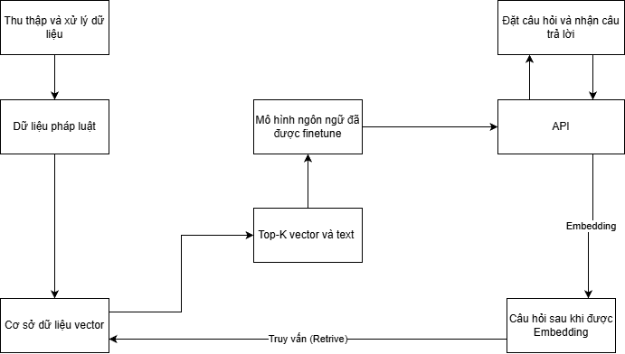
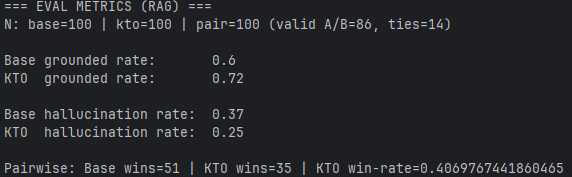

# JurisAI: Chatbot Tư vấn Pháp luật với RAG và Fine-tuning

---

**JurisAI** là một dự án xây dựng hệ thống chatbot thông minh, chuyên sâu về tư vấn pháp luật Việt Nam trong các lĩnh vực **Lao động, Bảo hiểm xã hội, và Thuế Thu nhập cá nhân (TNCN)**. Cốt lõi của dự án là một pipeline **RAG (Retrieval-Augmented Generation)** được tối ưu hóa bằng các kỹ thuật **Fine-tuning** (tinh chỉnh mô hình). Kiến trúc này cho phép chatbot cung cấp các câu trả lời chính xác, đồng thời trích dẫn nguồn văn bản luật cụ thể để đảm bảo tính minh bạch và độ tin cậy.

Toàn bộ hệ thống được thiết kế để hoạt động với các mô hình ngôn ngữ lớn (LLM) mã nguồn mở chạy cục bộ (local) trên máy tính cá nhân, nhờ đó dữ liệu người dùng không bị gửi ra ngoài và bảo vệ quyền riêng tư.

## Kiến trúc và Luồng xử lý AI

---




Pipeline AI bao gồm 4 giai đoạn chính:
### Giai đoạn 1: Xây dựng Nền tảng Tri thức (Knowledge Base Construction)

---

Mục tiêu của giai đoạn này là xây dựng một kho tri thức số có cấu trúc từ các văn bản luật thô, tối ưu hóa cho việc truy vấn ngữ nghĩa.

1.  **Thu thập Dữ liệu (Crawling):** Dữ liệu đầu vào (Luật, Nghị định, Thông tư) được thu thập tự động từ các cổng thông tin điện tử pháp luật chính thống bằng các script Python, sử dụng Selenium và BeautifulSoup để trích xuất nội dung từ các trang web động.

2.  **Phân tích & Phân đoạn Dữ liệu (Parsing & Chunking):** Các file văn bản `.docx` thô được xử lý bởi một parser tùy chỉnh (`data_management/parser.py`). Thay vì phân đoạn theo độ dài cố định, parser này được thiết kế để phân tích cấu trúc văn bản luật và chia nhỏ dữ liệu theo đơn vị logic là từng **Chương (Chapter)**, **Mục (Section)** và **Điều (Article)**. Cách tiếp cận này bảo toàn tính toàn vẹn ngữ nghĩa của mỗi quy định. Mỗi chunk được gán với một bộ metadata chi tiết:
    *   `source`: Tên file gốc.
    *   `document_name`: Tên đầy đủ của văn bản luật, được trích xuất tự động.
    *   `domain_legal`: Lĩnh vực pháp lý (BHXH, Lao động, Thuế TNCN).
    *   `chapter`, `section`, `article`: Các thông tin cấu trúc (Chương, Mục, Điều).

3.  **Vector hóa và Lập chỉ mục (Vectorization & Indexing):**
    *   **Lựa chọn Model Embedding:** Dựa trên kết quả benchmark trên tập dữ liệu pháp luật tiếng Việt **Zalo AI Legal Text Retrieval 2021**, mô hình **`intfloat/multilingual-e5-large`** được lựa chọn làm giải pháp embedding chính thức do sự cân bằng giữa hiệu năng truy xuất và hiệu quả tính toán.
    *   **Lưu trữ:** Các chunk văn bản và metadata tương ứng được chuyển đổi thành vector và được lưu trữ, lập chỉ mục trong **ChromaDB**. Toàn bộ cơ sở tri thức vector này được quản lý thông qua một ứng dụng quản trị (xây dựng bằng Streamlit), hỗ trợ các thao tác Thêm/Xóa tài liệu.

| Mô hình                                                      | Recall@10  |   MRR@10   |  nDCG@10   |
|:-------------------------------------------------------------|:----------:|:----------:|:----------:|
| `intfloat/multilingual-e5-large`                             | **0.8654** | **0.6366** | **0.6908** |
| `AITeamVN/Vietnamese-Embed`                                  |   0.8997   |   0.7332   |   0.7728   |
| `BAAI/bge-m3`                                                |   0.8312   |   0.5972   |   0.6530   |
| `sentence-transformers/paraphrase-multilingual-mpnet-base-v2`|   0.4302   |   0.2644   |   0.3030   |
| `dangvantuan/vietnamese-embedding`                           |   0.5139   |   0.3126   |   0.3600   |

### Giai đoạn 2: Truy xuất Thông tin (Retrieval)

---

Khi hệ thống nhận được câu hỏi từ người dùng, pipeline RAG thực hiện quy trình truy xuất thông tin như sau:

1.  Câu hỏi của người dùng được mã hóa thành một vector truy vấn bằng mô hình `multilingual-e5-large`.
2.  Hệ thống thực hiện một truy vấn tìm kiếm tương đồng (similarity search) trong ChromaDB để xác định **Top-K** các chunk văn bản có liên quan nhất về mặt ngữ nghĩa.

### Giai đoạn 3: Tinh chỉnh Hành vi Mô hình (Behavioral Fine-tuning)

---

Đây là giai đoạn nhằm tối ưu hóa hành vi sinh câu trả lời của LLM. Dự án triển khai một pipeline **RLAIF (Reinforcement Learning from AI Feedback)** để tinh chỉnh mô hình.

1.  **Tự động tạo Dữ liệu Sở thích (Preference Data Generation):**
    *   **Mô hình Sinh (Generator):** Mô hình **`vinai/Vinallama-7B-Chat`** được sử dụng để tạo ra hai phiên bản câu trả lời cho mỗi câu hỏi, dựa trên cùng một ngữ cảnh. Sự khác biệt được tạo ra bằng cách thay đổi chiến lược sinh văn bản.
    *   **Mô hình Giám khảo (Judge):** Một mô hình có khả năng suy luận mạnh hơn là **`Vistral-7B-Chat`** được sử dụng để so sánh hai câu trả lời và chọn ra câu tốt hơn (`chosen`) và câu kém hơn (`rejected`), dựa trên một bộ tiêu chí được định nghĩa trước (ưu tiên độ chính xác và bám sát ngữ cảnh).
    *   Quá trình này được tự động hóa hoàn toàn bằng script (`collect_aif_data.py`), cho phép tạo ra một bộ dữ liệu sở thích quy mô lớn mà không cần gán nhãn thủ công.

2.  **Huấn luyện với KTO (Kahneman-Tversky Optimization):**
    *   Dữ liệu sở thích sau đó được định dạng lại để phù hợp với yêu cầu của **KTO**, một kỹ thuật fine-tuning dựa trên sở thích (preference-based).
    *   Mô hình chatbot chính (ví dụ: `Qwen/Qwen2-4B-Instruct`) được fine-tune bằng `KTOTrainer` của thư viện Hugging Face TRL.
    *   Để thực hiện trên phần cứng cá nhân (GPU 8GB VRAM), kỹ thuật **QLoRA** (Quantized Low-Rank Adaptation) đã được áp dụng, cho phép fine-tune hiệu quả bằng cách tải mô hình ở dạng 4-bit và chỉ huấn luyện một số lượng nhỏ các tham số.



### Giai đoạn 4: Sinh câu trả lời có Trích dẫn (Cited Generation)

---

Đây là luồng hoạt động cuối cùng của chatbot sau khi đã được fine-tune và tích hợp vào hệ thống.

1.  Hệ thống nhận câu hỏi và thực hiện truy xuất ngữ cảnh (như Giai đoạn 2).
2.  Ngữ cảnh (bao gồm nội dung văn bản và metadata) được định dạng lại và đưa vào một prompt có cấu trúc cùng với câu hỏi.
3.  Prompt này hướng dẫn mô hình LLM đã được fine-tune thực hiện hai nhiệm vụ:
    *   Viết một câu trả lời chi tiết dựa trên ngữ cảnh được cung cấp.
    *   Tạo một danh sách các trích dẫn (`citations`) chứa thông tin (`law_name`, `chapter`, `article`) của những nguồn đã được sử dụng.
4.  **Đảm bảo định dạng JSON:** Bằng cách kết hợp `JsonOutputParser` của LangChain và các tính năng của server (như Response Format của LM Studio), output của LLM được đảm bảo là một đối tượng JSON hợp lệ, cho phép backend xử lý và gửi về frontend một cách nhất quán.
5.  **Kết quả:** Người dùng nhận được một câu trả lời có cấu trúc, bao gồm nội dung và các nguồn trích dẫn pháp lý rõ ràng.

## Các Công nghệ Chính

---

*   **Backend:** Python, Flask, LangChain
*   **Frontend:** HTML, CSS, Vanilla JavaScript
*   **LLM & Embeddings:** Chạy local qua LM Studio (ví dụ: Qwen2, Vinallama, Vistral)
*   **Vector Database:** ChromaDB
*   **Triển khai:** Docker, Docker Compose
*   **Quản trị:** Streamlit


# Hướng dẫn Chạy Ứng dụng bằng Docker

---

### Yêu cầu
1.  Đã cài đặt [Git](https://git-scm.com/downloads).
2.  Đã cài đặt [GitLFS](https://git-lfs.github.com/)
3.  Đã cài đặt và đang chạy [Docker Desktop](https://www.docker.com/products/docker-desktop/).
4.  Đã cài đặt và đang chạy [LM Studio](https://lmstudio.ai/).

### Các bước thực hiện

**Bước 1: Tải và Chuẩn bị Mô hình trong LM Studio**

1.  Mở LM Studio.
2.  Tìm và tải về một phiên bản GGUF của mô hình bạn muốn dùng (ví dụ: `Qwen/Qwen3-4B-Instruct-2507-GGUF`). hay [mô hình đã finetune của mình](https://huggingface.co/bittersweet6699/Qwen3-4B-Instruct-2507-LEGAL-KTO-GGUF) 
3.  **Tải mô hình vào bộ nhớ:** Chuyển sang tab **"AI Chat"** (biểu tượng trò chuyện) và chọn mô hình đã tải từ menu thả xuống ở trên cùng. Chờ cho đến khi mô hình được load xong.
4.  **Khởi động Server:** Chuyển sang tab **"Local Server"** (biểu tượng `<>`), đảm bảo mô hình đã được chọn, và nhấn **"Start Server"**.

**Bước 2: Clone và Khởi động Ứng dụng**

1.  **Clone project từ GitHub:**
    Mở terminal (Git Bash, PowerShell, CMD) và chạy lệnh:
    ```bash
    git clone https://github.com/BDucNghia/JurisAI---Legal-RAG-Chatbot.git
    ```
    Tải các file văn bản luật
    ```bash
    git lfs pull
    ```
2.  **Di chuyển vào thư mục project:**
    ```bash
    cd JurisAI---Legal-RAG-Chatbot
    ```
3. **Tải mô hình embedding** </br>
    Chạy lệnh sau để tải mô hình embedding `intfloat/multilingual-e5-large`:
    ```bash
    python download_embedding_model.py
    ```
4. **Tải hoặc tạo ChromaDB dựa trên folder data_final (Chọn 1 trong 2 cách)**
    *   Cách 1: Ấn vào [đây](https://drive.google.com/drive/folders/1ZbtdpNaqk03Yr_o5iiFwNeHy4OzVIKsd?usp=drive_link) và tải file zip **db.rar** sau đó giải nén và cho vào data/db, cấu trúc sẽ có dạng:
    ```
    /main/
    └── data/
        └── db/
            ├── ... (các file của ChromaDB)
    ```
    *   Cách 2: Từ thư mục gốc, trong terminal chạy:
    ```bash
   python -m data_management.build_full_db
    ```
    Lệnh này sẽ đọc dữ liệu từ `data/data_final` và tạo ra cơ sở dữ liệu ChromaDB trong `data/db`. Quá trình này có thể mất vài phút.


5. **Chạy ứng dụng bằng Docker Compose:**
    Trong thư mục gốc của project (nơi chứa file `docker-compose.yml`), chạy lệnh:
    ```bash
    docker-compose up --build
    ```
    *   Lệnh này sẽ tự động build image cho backend và khởi động container. Quá trình này có thể mất vài phút ở lần đầu tiên.
    *   Hãy để yên terminal này, nó sẽ hiển thị log của backend.

6. **Chạy giao diện Frontend:**
    *   Mở một **terminal mới**.
    *   Di chuyển vào thư mục `frontend`:
        ```bash
        cd frontend
        ```
    *   Khởi động một web server đơn giản:
        ```bash
        python -m http.server 8000
        ```
7. **Chạy ứng dụng Admin:** (tùy chọn, nếu bạn muốn quản lý dữ liệu)
    *   Mở một **terminal mới**.
    *   Di chuyển vào thư mục `backend`:
    ```bash
    cd backend
    ```
    *   Chạy ứng dụng Admin:
    ```bash
    streamlit run admin_app.py
    ```  


**Bước 3: Trải nghiệm Chatbot**

1.  Mở trình duyệt web của bạn.
2.  Truy cập địa chỉ: `http://localhost:8000`
3.  Bắt đầu đặt câu hỏi và trải nghiệm!


## Hướng dẫn dành cho Nhà phát triển (Developer Guide)

---

Nếu bạn muốn chạy các script quản trị (thêm/xóa dữ liệu) hoặc fine-tuning.

### Yêu cầu
*   Cài đặt Python 3.12+.

### Các bước
1.  **Clone project** (như trên Bước 1 và 2 ).
2.  **Tạo và kích hoạt môi trường ảo:**
    ```bash
    # Bên trong thư mục backend
    cd backend
    python -m venv .venv
    # Kích hoạt môi trường
    # Windows:
    .venv\Scripts\activate
    # macOS/Linux:
    # source .venv/bin/activate
    ```
3.  **Cài đặt dependencies:**
    ```bash
    pip install -r requirements.txt
    ```
4.  **Chạy ứng dụng Admin:**
    ```bash
    streamlit run admin_app.py
    ```
5.  **Chạy các script khác:**
    Luôn chạy từ thư mục gốc của project bằng cờ `-m`.
    ```bash
    # Chạy ứng dụng
    python -m backend.app
    ```
    
